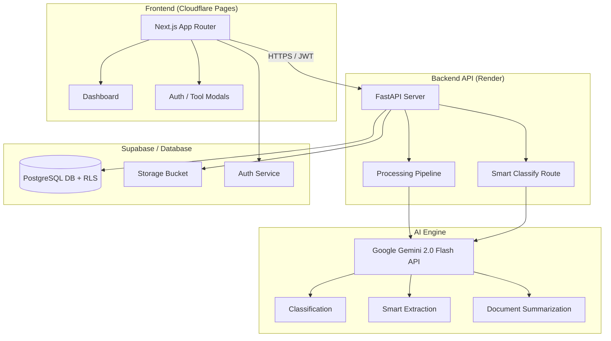

<div align="center">

<h1>🧠 NeuroDocs</h1>
<p><strong>AI-Powered Document Intelligence SaaS</strong></p>

<p>
  
  
  
  
</p>

<p>Transform unstructured PDFs, scanned documents, and images into structured data using Google Gemini AI — automatically.</p>

<a href="https://documind-1g2.pages.dev/"><strong>View Live Demo</strong></a> · <a href="https://neurodocs-api.onrender.com/docs"><strong>API Documentation</strong></a>
</div>

---

## ✨ Features

| Feature | Description |
|---|---|
| 🤖 **AI Pipeline** | Automated OCR → Classification → Extraction powered by Google Gemini 2.0 |
| 🔍 **Smart Extraction** | Pulls structured JSON data (vendor, amount, date, etc.) from any document format |
| 📑 **Auto-Classification** | Accurately identifies Invoices, Receipts, Contracts, Resumes, and more |
| 📊 **Finance Dashboard** | Unique "Invoice Review Queue" for human-in-the-loop verification and CSV/JSON export |
| 🔐 **Secure SaaS Auth** | JWT-based authentication via Supabase with strict Row Level Security (RLS) |
| 💳 **Monetization Engine** | Built-in Free/Pro/Enterprise tier logic with monthly upload and AI processing quotas |
| 🗜️ **PDF Utilities** | Free tools to merge, compress, and convert PDFs to images (no auth required) |

---

## 🏗️ Architecture

NeuroDocs is a modern, decoupled full-stack application built for scale and low memory constraints. By utilizing "**AI-as-a-Service**" (Gemini API) rather than local ML models (like PyTorch/EasyOCR), the backend remains incredibly lightweight (< 50MB RAM) while achieving significantly higher extraction accuracy.



---

## 🚀 Quick Start

### Prerequisites
- Node.js 18+
- Python 3.10+
- A [Supabase](https://supabase.com) project
- A [Google AI Studio](https://aistudio.google.com/) API Key

### 1. Frontend Setup (Next.js)
```bash
# Install dependencies
npm install

# Setup environment variables
cp .env.local.example .env.local
# Add your NEXT_PUBLIC_API_URL and Supabase keys

# Start development server
npm run dev
```

### 2. Backend Setup (FastAPI)
```bash
cd backend
python -m venv .venv
source .venv/bin/activate  # Or .venv\Scripts\activate on Windows

# Install dependencies
pip install -r requirements.txt

# Setup environment variables
cp .env.example .env
# Add your GEMINI_API_KEY, Supabase keys, and JWT_SECRET

# Run the server
uvicorn main:app --reload
```

---

## 🤖 The AI Pipeline in Action

When a user uploads a document, NeuroDocs executes a multi-layered pipeline:

1. **OCR Layer:** `pypdf` extracts native text from digital PDFs instantly. If the document is an image or scanned PDF, it falls back to Gemini Vision for high-fidelity OCR.
2. **Classification Layer:** Deterministic keyword rules act as a fast primary classifier. If confidence is low, the text is sent to Gemini for contextual classification.
3. **Extraction Layer:** Gemini intelligently extracts relevant fields based on the document type (e.g., pulling vendor name, tax, and total from an Invoice).

**Example API Response:**
```json
{
  "document": {
    "filename": "acme_invoice_march.pdf",
    "status": "completed"
  },
  "ai_analysis": {
    "document_type": "Invoice",
    "confidence": 0.98,
    "summary": "This is an invoice from Acme Corp for web design services totaling $4,500 due on March 30th.",
    "extracted_fields": {
      "vendor": "Acme Corp",
      "invoice_no": "INV-10492",
      "amount": "$4,500.00",
      "due_date": "March 30, 2026",
      "tax": "$0.00"
    }
  }
}
```

---

## 🛠️ Tech Stack

**Frontend**
- Next.js 14 (App Router)
- React, TypeScript, TailwindCSS
- Framer Motion & Three.js (3D animations)
- Supabase Auth Client

**Backend**
- Python 3.10+, FastAPI, Uvicorn
- Google Generative AI SDK (Gemini 2.0 Flash)
- PyPDF, Pillow

**Infrastructure**
- **Hosting:** Cloudflare Pages (Frontend) & Render (Backend API)
- **Database & Storage:** Supabase (PostgreSQL)

---

## 🙋‍♂️ Author
**Harshwardhan Bhaskar**
- Built as a full-stack AI + SaaS showcase project demonstrating modern LLM integration and production-ready architecture.
